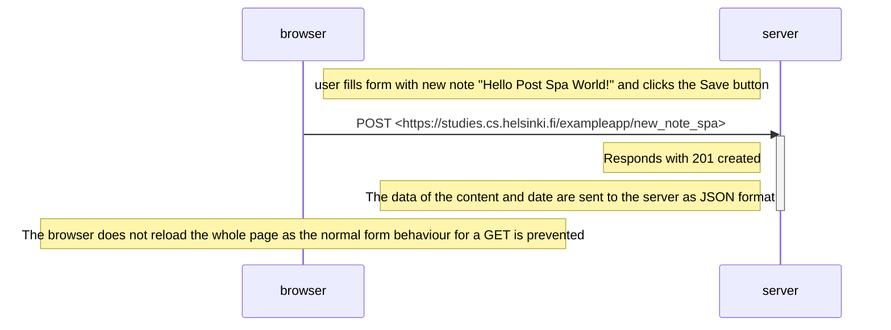

# Part 0.6 - New note in Single page app diagram

Diagram  depicting the situation where the user creates a new note using the single-page version of the app. This sequence diagram was used using `Mermaid`-syntax.

