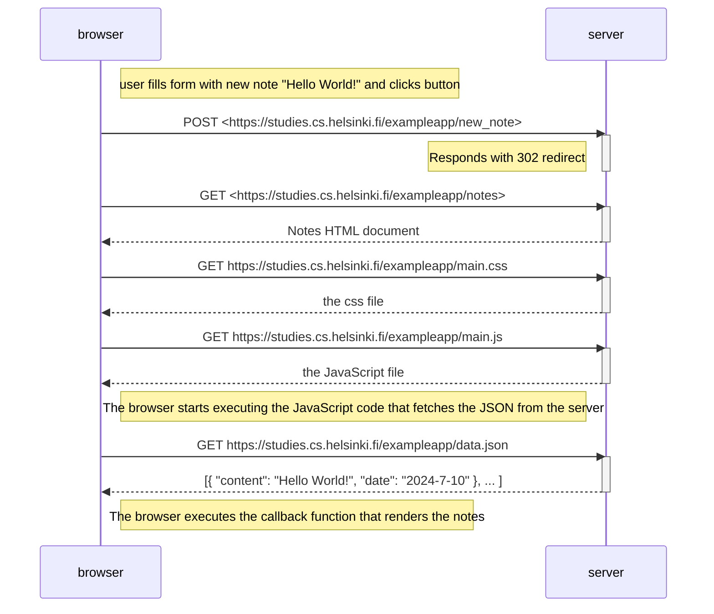

# Part 0.4 - New Note Diagram

Diagram depicting the situation where the user creates a new note. This sequence diagram was used using `Mermaid`-syntax.

```mermaid
sequenceDiagram
    participant browser
    participant server

    Note right of browser: user fills form with new note "Hello World!" and clicks button
    browser->>server: POST <https://studies.cs.helsinki.fi/exampleapp/new_note>
    activate server
    Note left of server:Responds with 302 redirect
    deactivate server
 
    browser->>server: GET <https://studies.cs.helsinki.fi/exampleapp/notes>
    activate server
    server-->>browser: Notes HTML document
    deactivate server

    browser->>server: GET https://studies.cs.helsinki.fi/exampleapp/main.css
    activate server
    server-->>browser: the css file
    deactivate server

    browser->>server: GET https://studies.cs.helsinki.fi/exampleapp/main.js
    activate server
    server-->>browser: the JavaScript file
    deactivate server

    Note right of browser: The browser starts executing the JavaScript code that fetches the JSON from the server

    browser->>server: GET https://studies.cs.helsinki.fi/exampleapp/data.json
    activate server
    server-->>browser: [{ "content": "Hello World!", "date": "2024-7-10" }, ... ]
    deactivate server

    Note right of browser: The browser executes the callback function that renders the notes
```
